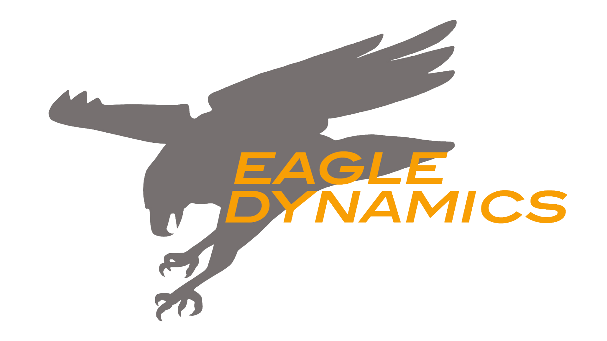
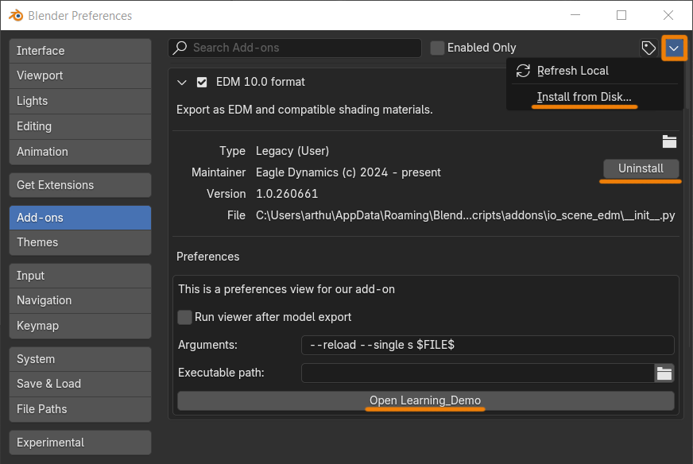
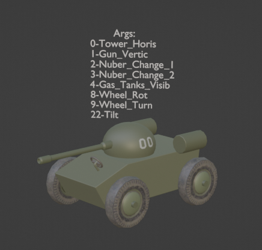
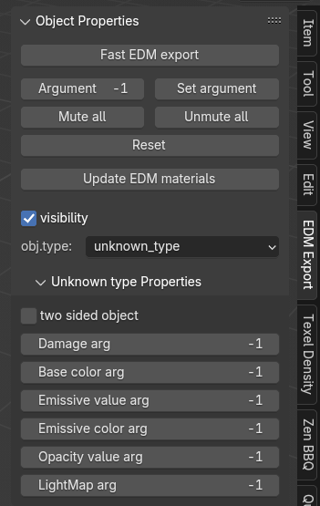

  
&nbsp;&nbsp;&nbsp;
   

# Blender-EDM-Exporter
Blender plugin for exporting 3D models into the EDM format used in DCS World. Enables artists and modders to prepare assets for the simulator with streamlined export workflows and integration support.

---

> Eagle Dynamics would especially like to thank the following people:
>
> - Lead developer [Evgeny Podjachev](https://github.com/madevgeny)
> - Senior developer [Alena Vasileva](https://github.com/baa-lamb)
> - 3D designer [Artur Manannikov](https://www.artstation.com/arthurchik)
> - Project manager [Timothy Misharov](https://github.com/Azralar)

> [!IMPORTANT]
> Supported blender versions of the latest version of the addon (We can't guarantee not having bugs with other unstable versions):
>
> - **3.6.x LTS**
> - **4.2.x LTS**
> - **4.5.x LTS**

---

# Summary

- [How to Install and Remove the Add-on](#how-to-install-and-Remove-the-add-on)
- [Learning Demo](#Learning-demo)
- [Core Functionality](#Core-functioanlity)
- [Documentation](#documentation)

---

## How to Install and Remove the Add-on

Download from:   https://files.eagle.ru/mods/edm_blender_plugins/

Or go to the Releases section of the https://github.com/EagleDynamics. Then download the zip file **edm_tools_blender_plugin.zip** of the latest release.

Plugin installation in Blender is performed in the standard way.

Through the menu Preferences → Add-ons → Install From Disk.

Removal is done in the same menu: in the add-on’s own tab, press the Uninstall button.

---

## Learning Demo

Learning Demo scenes are located in the add-on folder - examples for training.

`C:\Users\YourUser\AppData\Roaming\Blender Foundation\Blender\3.6\scripts\addons\io_scene_edm\Learning_Demo`

---

## Core Functionality

The EDM Export panel, located in the N-panel, provides essential tools for preparing models and animations for export. 

It allows you to: assign **argument numbers** to animations, specify **object types** (e.g. connectors, collisions, etc.), configure **visibility animations**, enable **two-sided rendering**, set **damage arguments** for destructible elements, etc.

**Argument** - Selects the active argument for animation playback

**Set Argument** - Disables all animations except the one matching the selected argument

**Mute All** - Turns off all animations

**Unmute All** - Enables all animations

**Reset** - Clears all animations and sets the timeline range from frame 0 to 200

**Update EDM Materials** - Refreshes materials in the scene (useful when new versions are available)

**Visibility** — toggle object visibility on/off

**Obj.Type** — select object type (BoundingBox / Collision / Connector, etc.)

**Two sided objects** — enable double-sided geometry rendering

**Damage arg** — damage animation argument Base color arg — argument for animating the Base Color in the material

**Emissive value arg** — argument for animating emission strength

**Emissive color arg** — argument for animating emission color

**Opacity value arg** — argument for animating material transparency multiplier

**LightMap arg** — argument for animating LightMap texture switching

---

## Documentation

If you want to learn how to use this add-on you can refer to the documentation page here : [Blender plugin tutorial (PDF)](MANUAL/tutorial-for-the-blender-plugin.pdf)

---
